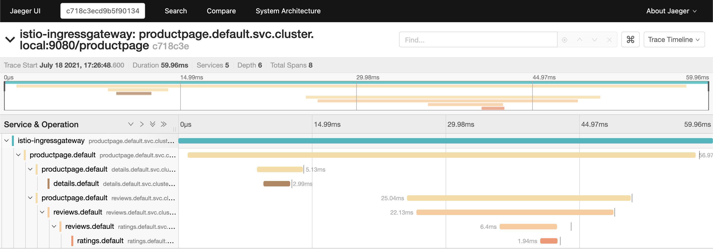
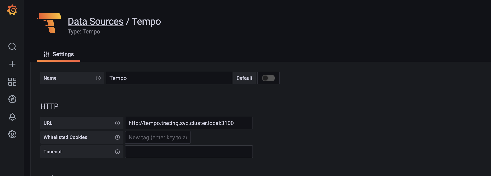
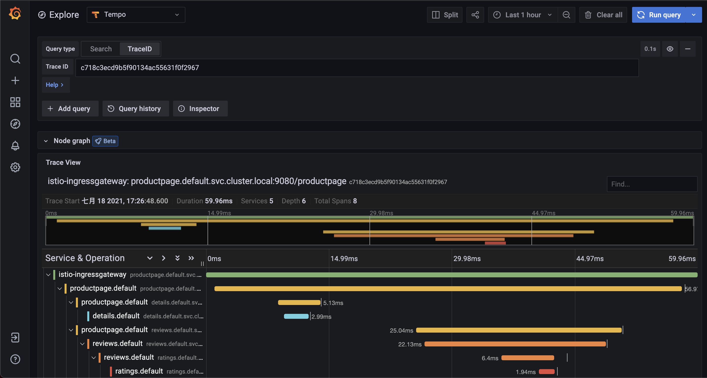

# Istio Tracing Example with Grafana Tempo

## Prerequisites
- [kind](https://kind.sigs.k8s.io/): a tool for running local Kubernetes clusters using Docker container “nodes”.
kind was primarily designed for testing Kubernetes itself, but may be used for local development or CI.
- [Istio](https://istio.io/latest): version 1.9.x or newer.
- [Helm](https://helm.sh/): version 3 or newer.

## Environment preparation

### Create Kubernetes cluster
```bash
kind create cluster --name istio-grafana-tempo --config kind-cluster.yaml
```

### Install Istio
```bash
istioctl install --set profile=demo --filename istio-profile.yaml
```

### Install Bookinfo application
Please visit [here](https://istio.io/latest/docs/examples/bookinfo/#deploying-the-application) and follow the steps to install Bookinfo application.

### Install Grafana
```bash
kubectl apply -f samples/addons/grafana.yaml
```

### Install Grafana Tempo all-in-one
```
helm install \
  --namespace tracing  --create-namespace \
  tempo grafana/tempo \
  --set tempo.receivers.zipkin.endpoint=0.0.0.0:9411
```

### Send request to Bookinfo application
```bash
for i in $(seq 1 10); do curl -s -o /dev/null "http://$GATEWAY_URL/productpage"; done
```

## Trace the request
1. Get trace ID from productpage pod
    ```bash
    kubectl logs -n default $PRODUCTPAGE_POD --container productpage | grep 'X-B3-TraceId'
    # copy the string follow 'X-B3-TraceId', like 'dcca94640002c5856c9aaad9d4a428c8'.
    ```
### Check in Jaeger UI
1. Expose Jaeger UI
    ```bash
    kubectl port-forward -n tracing service/tempo 16686:16686
    ```
2. Go to [http://localhost:16686](http://localhost:16686)
3. Paste trace ID and search



### Grafana Tempo Datasource
1. Expose Grafana
    ```bash
    kubectl port-forward -n istio-system service/grafana 3000:3000
    ```
2. Go to [http://localhost:3000](http://localhost:3000) Configuration > Data Source > Add data source > Tempo
3. Set URL and save

4. Go to Explore > Tempo, paste trace ID and search


## Cleanup
```bash
kind delete clusters istio-grafana-tempo
```
